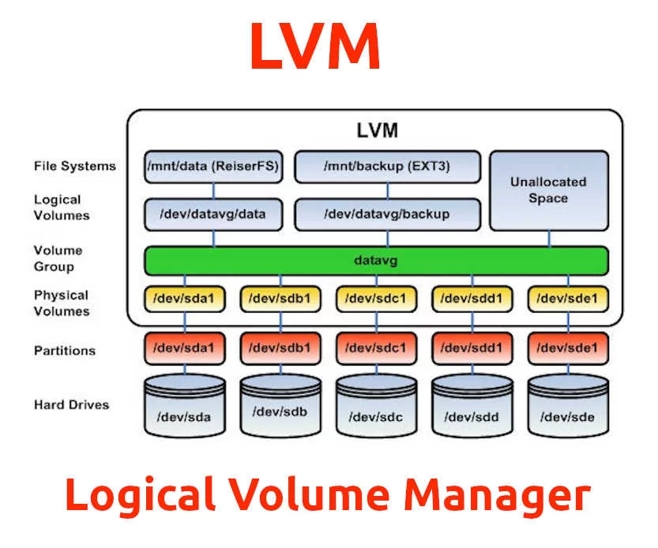

# Práctica 2d. Volúmenes Lógicos(LVM)

## Contexto
El volúmen de información a manejar crece e muchas ocasiones de forma no prevista. Una previsón a la baja en la asignación del espacio de almacenamiento en unidades físicas puede ocasionar quedarnos sin espacio con el problema que ello conlleva, una asignación a la alta supone perdida de espacio para otros fines. Mediante LVM o Logical Volumen Management obtenemos mediante una capa de abstracción sobre el volumen físico mayor flexibilidad a la hora de incrementar, reducir el espacio inicialmente previsto para nuestros datos.

En esta práctica se trabajará sobre la creación y gestión de volúmenes lógicos.

## Objetivos
* Entender que es LVM y como mejora el esquema estático de asignación de espacio.
* Explicar de forma gráfica la arquitectura de LVM.
* Crear y configrar LVM mediante comandos.
* Ser capaces de plantear un hipotético caso de ampliación de espacio en un volúmen lógico
* Documentar de forma correcta y completa los pasos llevados para realizar la práctica.


## Definición y Arquitectura de LVM
>[!NOTE]
> Explicar ayudándote de una imagen la arquitectura de LVM



LVM tiene 3 conceptos clave:
- Volumenes físicos: Los volumenes físicos corresponden a discos duros.
- Grupos de vulmenes: Estos son el conjunto de volumenes fisicos los cuales estan unidos y funcionarán de forma conjunta.
- Volumenes lógicos: Corresponden a particiones, estas conteienen un sistema de archivos.

La arquitectura LVM esta pensada para mediante software tener una forma mas flexible de almacenar datos asi como una facilidad de manejar el espacio y las particiones que es capaz de contener.

## Desarrollo
## Introducción
>[!NOTE]
> Explicar brevemente en que va a consistir la práctica, ayúdate de una imágen para tu explicación.

En esta práctica vamos a crear un sistema de archvios el cual contendrá 4 carpetas llamadas lv_deb, lv_net, lv_projects y lv_web
Para esto añadiremos discos a la maquina virtual, y a conticuación crearemos los volumenes físicos, estos los agregaremos a un grupo de volumenes llamado vg-sad000, por ultimo haremos los volumenes lógicos.

### Paso 1. Pasos previos
>[!NOTE]
> Explicar la ampliacion de la máquina virtual con nuevos discos duros

Primero editamos el archvio de la maquina virtual para añadir varios discos:
```bash
Vagrant.configure("2") do |config|
  config.vm.box = "generic/ubuntu2304"
  config.vm.box_version ='4.3.12'
  config.vm.hostname = 'generic-sad'
  config.vm.define vm_name = 'generic-sad'
  config.ssh.forward_agent = true
  config.ssh.forward_x11 = true
  config.vm.disk :disk, size: "200MB", name: "extra_storage1"
  config.vm.disk :disk, size: "200MB", name: "extra_storage2"
  config.vm.disk :disk, size: "200MB", name: "extra_storage3"
  config.vm.disk :disk, size: "200MB", name: "extra_storage4"
  config.vm.disk :disk, size: "200MB", name: "extra_storage5"
  config.vm.disk :disk, size: "200MB", name: "extra_storage6"
```

### Paso 2. Set up de nuestro entorno de trabajo

Crearemos el grupo logico que vamos a usar mediante el comando `vgcreate vg-sad000 /dev/sdb /dev/sdc`


Una vez la maquian ha iniciado de forma correcta creamos los vloumenes físicos:

```bash
pvcreate /dev/sdb
pvcreate /dev/sdc
```

### Paso 3. Asignación de los volúmenes lógicos

Creamos los voulumenes con lvcreate, aqui estan las 2 formas diferentes de hacerlo, en la primera definimos el espacio al cual queremos que tenga mediante el `-L`, y en la segunda forma definimos el espacio mediante el porcentaje que queremos que use usando el `-l`

```bash
lvcreate -n lv_db -L 100MB vg-sad000
lvcreate -n lv_net -l 100%FREE vg-sad000
```

Vamos a definir su sistema de archivos como ext4 para esto usaremos el siguiente comando en cada carpeta:
```bash
mkfs.ext4 /dev/vg-sad000/lv_projects
mkfs.ext4 /dev/vg-sad000/lv_net
```

### Paso 4. Montaje de los discos

El montaje de los discos se resuleve mediante el comando mount, este comando solo es temporal.

```bash
mkdir /mnt/net
mount /dev/vg-sad000/lv_net /mnt/net
mkdir /mnt/db
mount /dev/vg-sad000/lv_db /mnt/db
```

### Paso 5. Aumento de un disco

Vamos a aumentar el tamaño de uno de los volumenes logicos, para esto vamos a crear el disco sdd, luego lo añadiremos al grupo correspondiente y por ultimo lo extenderemos al tamaño deseado.

```bash
pvcreate /dev/sdd
vgcreate vg-sad000 /dev/sdd
lvextend -L 200MB /dev/vg-sad000/lv_db /dev/sdc /dev/sdd
```
